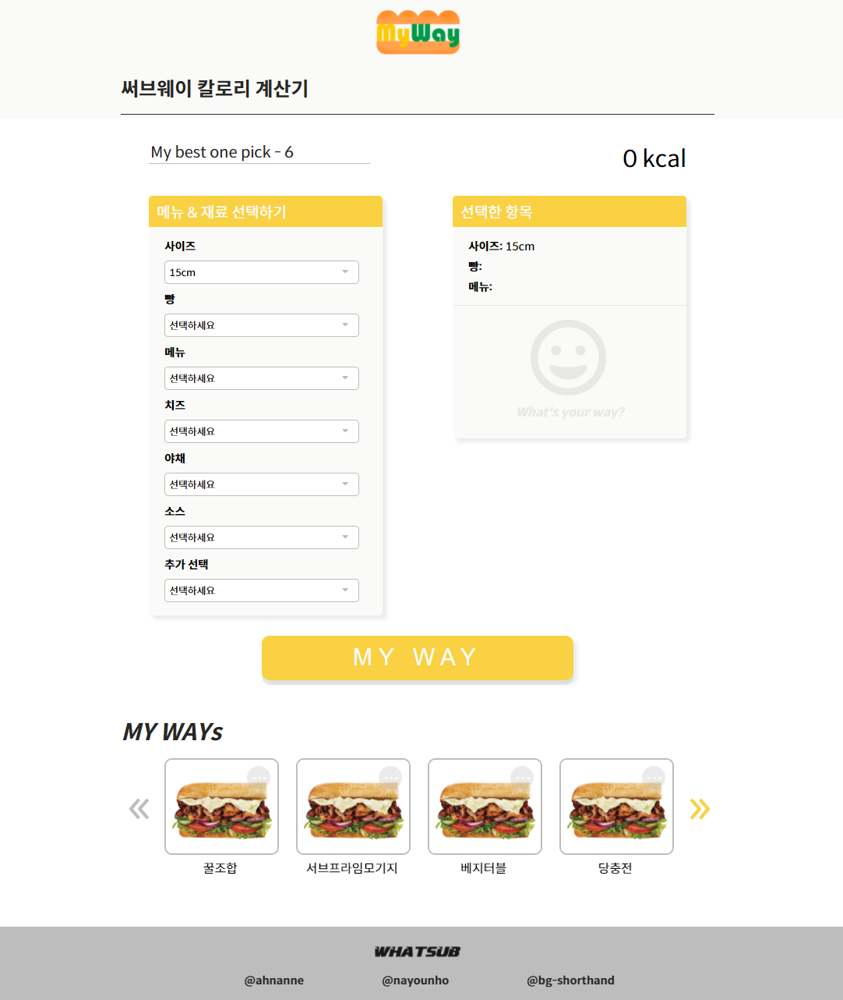

# MyWay 프로젝트
#### by 

### MyWay 기획 의도

- [써브웨이](https://www.subway.co.kr/)는 다양한 고객층이 즐겨 찾는 샌드위치 전문점입니다. 써브웨이에서 고객은 자신의 입맛대로 샌드위치를 커스텀 해서 먹을 수 있습니다. 샌드위치의 칼로리는 각각의 메뉴와 야채, 소스, 추가 메뉴 등을 어떻게 조합하는지에 따라 천차만별입니다. MyWay는 칼로리를 예측하고 싶은 써브웨이 고객들을 대상으로 <b>써브웨이 샌드위치 전용 칼로리 계산 기능</b>을 제공하는 서비스입니다.

- 써브웨이에서 제공하는 메뉴별 칼로리를 참고할 수도 있지만, 어떤 재료를 선택하는지에 따라 고객이 매번 일일이 계산해야 합니다. MyWay는 이러한 번거로움 없이 원하는 재료를 선택하기만 하면 바로바로 칼로리를 계산하고, 고객은 그 결과를 즐겨 찾는 조합으로 저장해놓을 수도 있습니다.

### MyWay 주요 기능 소개

- 써브웨이 샌드위치 메뉴별·조합별 칼로리 계산

- 샌드위치 조합 즐겨찾기 저장

___

### 프로젝트 목적

- ES6 학습 내용과 Sass, TypeScript를 활용한 실제 서비스 구현 경험

- Webpack을 이용한 자바스크립트 모듈 관리 경험

- Express와 axios 라이브러리를 통한 HTTP 통신 실습

- Git, GitHub를 활용한 협업 경험

### Stack

- HTML/CSS

- JavaScript

- ESLint

- Sass

- TypeScript

- Webpack: 모듈 번들러

- Express: 서버 구축

- axios: HTTP 통신

- Git/GitHub: 협업툴

### WHATSUB 팀원 소개

- 나윤호 [@nayounho](https://github.com/nayounho)

- 안예인 [@ahnanne](https://github.com/ahnanne)

- 한병국 [@bg-shorthand](https://github.com/bg-shorthand)
